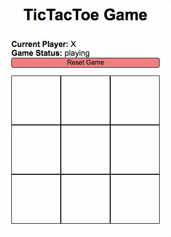

# TicTacToe

A TicTacToe game created using Angualar 10, as part of Front End bootcamp of IGTI.

## Technologies

## Preview

## Goals

- Create the board values with Angular
- Display the game status
- Verify winners each move
- Allow to reset the game

## How it works

The main structure of the project is inside `./src/app/core` folder. The `core` is an Angular component with all logic of the game.

The component is divided into three files: the html structure, the css style and the typescript logic.

The game controllers are defined at the top, with these parameters:

- `isXPlayer`: it is a boolean variable that checks if the current player is the `X` or the `O`
- `moves`: count how many moves are made, with a maximum of 9 moves each match
- `gameStatus`: default status is `playing`. It changes to `Player X`, when the player `X` wins the game. Otherwise, display `No Winners`
- `boardGame`: its an array with all game cells

Every time the user click on a div, three cases are verified:

- If already has a winner `if (this.checkWinner())`
- If more moves are allowed `else if (this.moves === 9)`
- Other, wise the game continue
